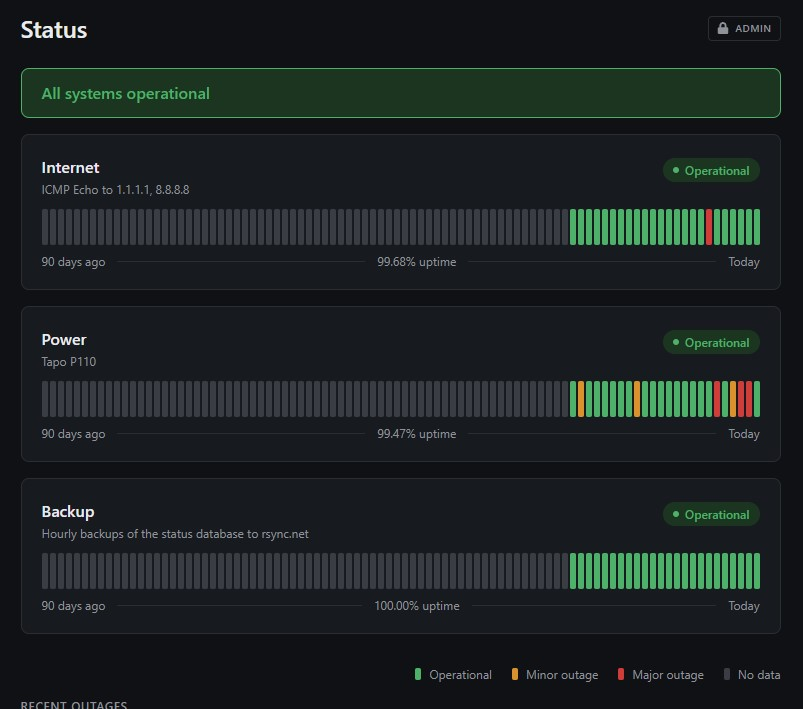

# Power status

A status page to track power (and internet!) outages.



### Deployment guide

```sh
# Ensure cargo, npm, caddy are installed

cd /opt
git clone https://github.com/radiantly/power-status
cd power-status
# cp src/config.example.rs src/config.rs

cargo build --release

cp power-status.service /etc/systemd/system/
systemctl daemon-reload
systemctl enable --now power-status

cp Caddyfile /etc/caddy/Caddyfile

# Build the frontend
cd site
npm ci
npm run build

systemctl restart caddy
```

### Architecture overview

- `monitor` table: Contains four columns
  - `id` - string, primary key.
  - `up` - integer 0 or 1, whether what is being monitored is up.
  - `last_update` - integer timestamp, stores what time the `up` status was last updated.
  - `next_update_in` - integer seconds, the maximum time duration before the next update.
- `outages` table: We only store aggregated outages. No individual pings. There are pros and cons, but I decided to go this route because less data, simpler to handle. But that also means we currently cannot store statistics like latency for internet or voltage reading for power.
  - `monitor_id` - string, foreign key.
  - `start` - integer timestamp, denotes when an outage started. If a monitor does not have any outages (on first start), we insert an outage with (start = 0, end = current_timestamp, untracked = 1) denoting no data during the period.
  - `end` - integer timestamp, can be null. if null, indicates ongoing outage.
  - `untracked` - integer 0 or 1, if untracked just means we don't have data during the specified time period.
- `outage_info` table
  - `(monitor_id, start)` - primary key, foreign key.
  - `excluded` - integer 0 or 1. Untracked outages are excluded by default while tracked outages aren't.
  - `notes` - string, some text describing the outage for the frontend.

Note: There's slightly unintuitive behavior when an outage is extremely short. If a monitor goes down, an outage row is added (start = current_timestamp, end = NULL, untracked = 0). However on the next ping if it is back up, we delete the outage row because the outage technically has a length of zero. This is because outages.end is set to last_update and not current_timestamp.
